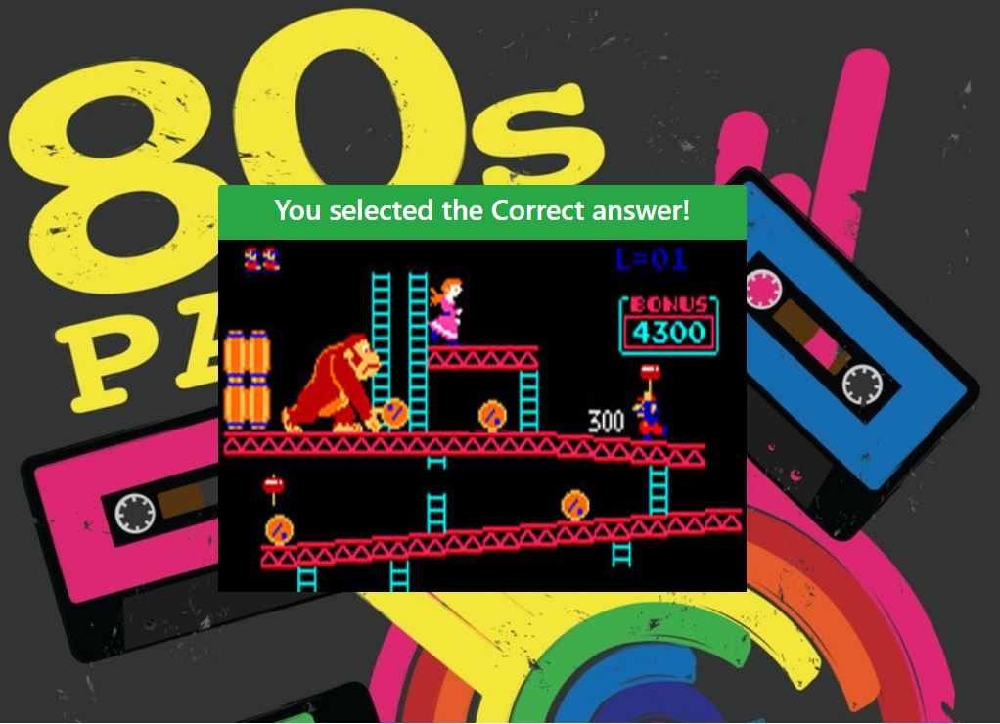

# Trivia-Game
80's Trivia Game using timers and timeouts

## Deployed Application
https://sthmpsn.github.io/Trivia-Game/

## Instructions
* Click the Start box to start the quiz
* Select the correct answer before the time runs out (10 seconds)
* There are 10 questions

## Technologies
* HTML  
* CSS  
* Javascript  
* jquery  
* Bootstrap  

## Screenshots

## Contributors
* Steve Thompson (sthmpsn)
